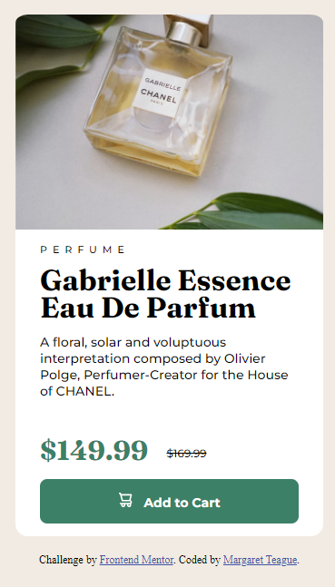

# Frontend Mentor - Product Preview Card Component

This is a solution to the [Product Preview Card Component challenge on Frontend Mentor](https://www.frontendmentor.io/challenges/product-preview-card-component-GO7UmttRfa). Frontend Mentor challenges help you improve your coding skills by building realistic projects. 

## Table of contents

- [Overview](#overview)
  - [Screenshot](#screenshot)
  - [Links](#links)
- [My process](#my-process)
  - [Built with](#built-with)
  - [What I learned](#what-i-learned)
  - [Continued development](#continued-development)
- [Author](#author)

## Overview

### Screenshot

<figure>
    
    <figcaption>Screenshot of mobile design</figcaption>
</figure>

### Links

- Solution URL: <a href="https://www.frontendmentor.io/solutions/responsive-qr-code-page-1l9b_yNchZ" target="_blank">Frontend Mentor Solution</a>
- Live Site URL: <a href="https://margaret-in-cali.github.io/product-preview-card-component-main/" target="_blank">View on GitHub</a>

## My process

I enjoyed this project. It was a little more involved than the QR Code challenge. I made sure to add alt text to all images (a task I missed in the last challenge), and I relied more heavily on block elements instead of making everything a div, as someone in the community suggested to me last time.

### Built with

- Semantic HTML5 markup
- CSS custom properties
- Flexbox

### What I learned

I wrestled a little bit with the border radius of several elements and needed to review the shorthand, so as to make the entire card appear as one component.

### Continued development

I feel pretty comfortable coding responsive layouts, but I could definitely improve. That's what I'm going to focus on in the immediate future.

## Author

- Website - [Margaret Teague](https://www.margaretteague.dev)
- Frontend Mentor - [@Margaret-In-Cali](https://www.frontendmentor.io/profile/Margaret-In-Cali)
- Twitter - [@MargNation](https://www.twitter.com/MargNation)
